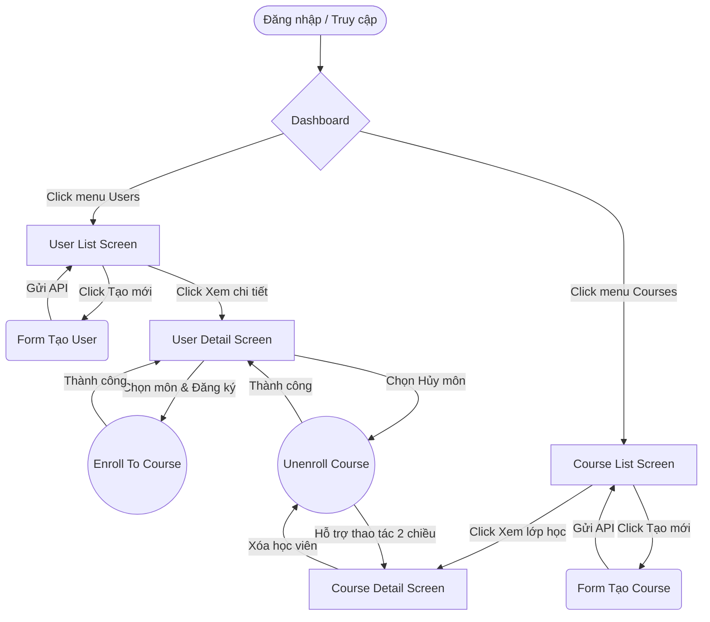

# Frontend Specification: Quản lý Đào tạo / Học viên

Dựa trên cấu trúc Backend (Models `User` và `Course` có quan hệ Many-to-Many), đây là tài liệu đặc tả màn hình (Frontend) dành cho hệ thống.

## 1. Danh sách màn hình (Sitemap)

- **🖥️ Dashboard (Trang chủ)**
  - Tổng quan hệ thống (Thống kê nhanh)
- **👤 Quản lý Người dùng (User Management)**
  - `User List` - Màn hình Danh sách Người dùng
  - `User Detail` - Màn hình Chi tiết Người dùng (Xem thông tin cá nhân & thời khóa biểu các khóa học đã đăng ký)
- **📚 Quản lý Khóa học (Course Management)**
  - `Course List` - Màn hình Danh sách Khóa học
  - `Course Detail` - Màn hình Chi tiết Khóa học (Xem thông tin khóa học & danh sách học viên lớp đó)

---

## 2. Các trường dữ liệu cần hiển thị (Data Fields)

### Màn hình User List (Danh sách Người dùng)
| Trường dữ liệu | Loại (Type) | Chức năng / Hiển thị |
| :--- | :--- | :--- |
| ID | Number | Mã định danh người dùng. |
| Họ tên (Name) | Text | Tên hiển thị người dùng. |
| Email | Text | Địa chỉ email (duy nhất). |
| Ngày tham gia | Date | Format từ `createdAt` (VD: DD/MM/YYYY). |
| Hành động | Buttons | Nút "Xem chi tiết", "Xóa người dùng" (Gọi API `DELETE /users/:id`). |
| **Tạo mới (Popup/Modal)** | Form | 2 Input field: Tên và Email kèm nút Save (Tạo user). |

### Màn hình User Detail (Chi tiết Người dùng)
| Trường dữ liệu | Loại (Type) | Chức năng / Hiển thị |
| :--- | :--- | :--- |
| Thông tin User | Section | Hiển thị: ID, Name, Email. |
| Khóa học đã đăng ký | List/Table | Hiển thị danh sách các `Course` (gồm: Course ID, Title, Code) mà user này đã tham gia (Từ API `GET /api/users/:id`). |
| Hành động (Khóa học) | Buttons | Nút "Hủy đăng ký" để loại user này khỏi khóa học đó (API `POST /api/unenroll`). |
| **Đăng ký môn mới** | Tùy chọn | Một Dropdown/Select danh sách khóa học và nút "Đăng ký" (API `POST /api/enroll`). |

### Màn hình Course List (Danh sách Khóa học)
| Trường dữ liệu | Loại (Type) | Chức năng / Hiển thị |
| :--- | :--- | :--- |
| ID | Number | Mã định danh khóa học. |
| Mã khóa học (Code) | Text | Mã duy nhất của môn/khóa (VD: JS2004). |
| Tên khóa học (Title) | Text | Tiêu đề hiển thị của khóa học (VD: NodeJS). |
| Hành động | Buttons | Nút "Xem chi tiết lớp", "Xóa khóa học" (Gọi API `DELETE /api/courses/:id`). |
| **Tạo mới (Popup/Modal)** | Form | 2 Input field: Title và Code kèm nút Save (Tạo Course). |

### Màn hình Course Detail (Chi tiết Môn học/Khóa học)
| Trường dữ liệu | Loại (Type) | Chức năng / Hiển thị |
| :--- | :--- | :--- |
| Thông tin Khóa học | Section | Hiển thị: ID, Title, Code. |
| Danh sách Lớp / HV | List/Table | Hiển thị danh sách `Users` đang tham gia khóa học này (Gồm ID, Name, Email). |
| Hành động (Học viên) | Buttons | Nút "Xóa HV khỏi lớp" ở mỗi record (API `POST /api/unenroll`). |

---

## 3. User Flow (Luồng người dùng)

**Mô tả luồng "Ghi danh khóa học (Enroll)"**:
1. Admin truy cập màn hình `User List`, chọn một học viên cụ thể bấm "Xem chi tiết".
2. Hệ thống tải màn hình `User Detail`, lấy thông tin cá nhân và thời khóa biểu của học viên thông qua API `GET`.
3. Admin thấy học viên cần học môn "ReactJS" liền chọn dropdown "Đăng ký môn mới", chọn ReactJS và bấm "Ghi danh".
4. Frontend sẽ gọi API `POST /api/enroll` truyền `{ userId, courseId }`.
5. Sau khi nhận báo cáo thành công, UI danh sách môn học tự động reload thêm môn ReactJS vào danh sách của học viên này.
